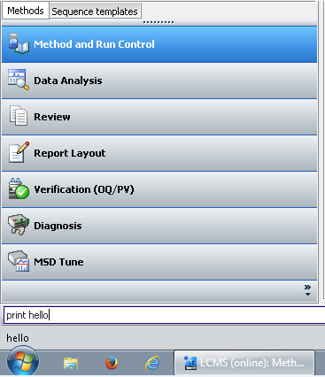

## Description

This folder contains Python classes developed to interface with common lab equipment for chemical synthesis.

Each Python file contains information regarding the hardware model, manufacturer, and setup. See the end of each file for example code to test hardware control.
Manuals for the various equipment are compiled in the `manuals` folder. This code is unofficial and we are not affiliated with any of the equipment manufacturers.

Code was tested using Python version 3.5 on Windows 10.

## Equipment with Serial Communication Interface

Required Python packages:
- [pySerial](https://pyserial.readthedocs.io/en/latest/) (installation commands: `pip install pyserial` or `conda install pyserial`)

The following hardware classes utilize the serial communication protocol:
- `alicat_pressure_controller.py`: control the pressure setpoint of an Alicat pressure controller
- `rheodyne_valve.py`: control the position of a Rheodyne selector valve
- `robot_control_gui.py`: control a Newmark Systems Cartesian robot and Robotiq 2-finger gripper with a GUI built using the tkinter Python package
- `vici_pump.py`: set the flow rate of a VICI M Series positive displacement pump
- `vici_valve.py`: actuate a VICI HPLC sample injection valve

Notes:
- The robot control GUI also requires the tkinter and crcmod Python packages
- For controlling a Sierra mass flow controller, see this [repo](https://github.com/patrickcgray/sierra_mfc_controller)

## Agilent HPLC ChemStation Control

Requirements:
- Agilent ChemStation software running on a Windows machine
- win32ui & dde Python packages (see documentation [here](https://stackoverflow.com/questions/28931475/get-data-via-dde-in-python-by-bypassing-excel) and [here](https://github.com/kovidgoyal/pywin32/blob/master/win32/Demos/dde/ddeclient.py))

The ChemStation software interface used to control Agilent HPLC instruments contains a command line interface (see simple 'print hello' command in picture below).

More advanced commands can be sent to start an HPLC method (enter 'StartMethod') or to request information such as whether the HPLC is currently running a method or not (enter 'ACQSTATUS$').

ChemStation is actually a DDE (Dynamic Data Exchange) client and it is possible to send commands to it programmatically by creating a DDE server in Python.
DDE is an early Windows interprocess communication protocol that still exists for backwards compatibility.

`agilent_hplc.py` contains a Python class to send commands to ChemStation to automate tasks such as:
- starting an HPLC method
- checking HPLC status
- obtaining sample name
- loading a specified HPLC method

For a more comprehensive list of commands, see `manuals/Agilent macro programming guide.PDF`.

## National Instruments Data Acquisition (DAQ) Devices

Requirements:
- nidaqmx Python library ([documentation](https://nidaqmx-python.readthedocs.io/en/latest/))
- NI-DAQmx driver (download [here](https://www.ni.com/en-us/support/downloads/drivers/download.ni-daqmx.html#428058))

NI devices can be used to read an analog voltage signal from a transducer (that senses pressure, for instance)
or to toggle a digital output on/off to control a relay.

`ni_daq_device.py` contains example code demonstrating these use cases.
